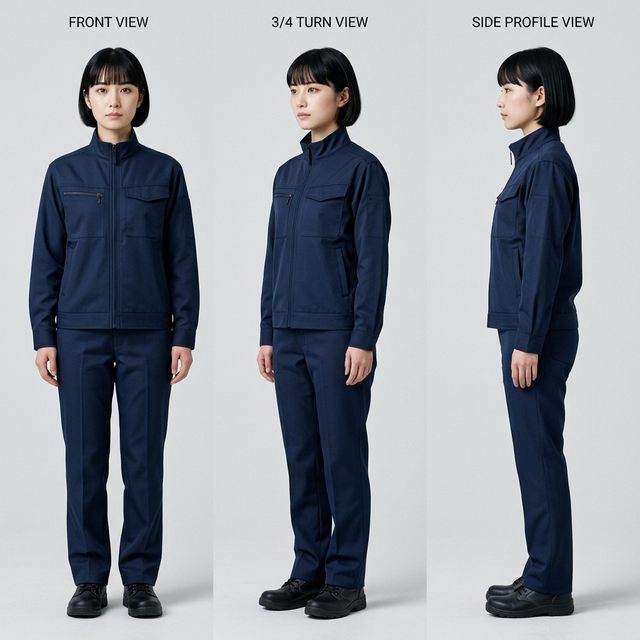
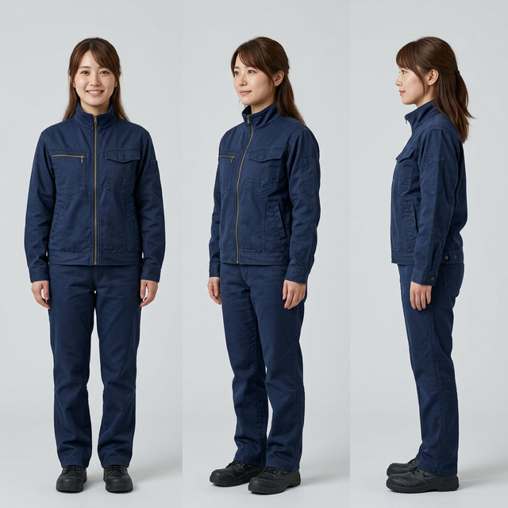
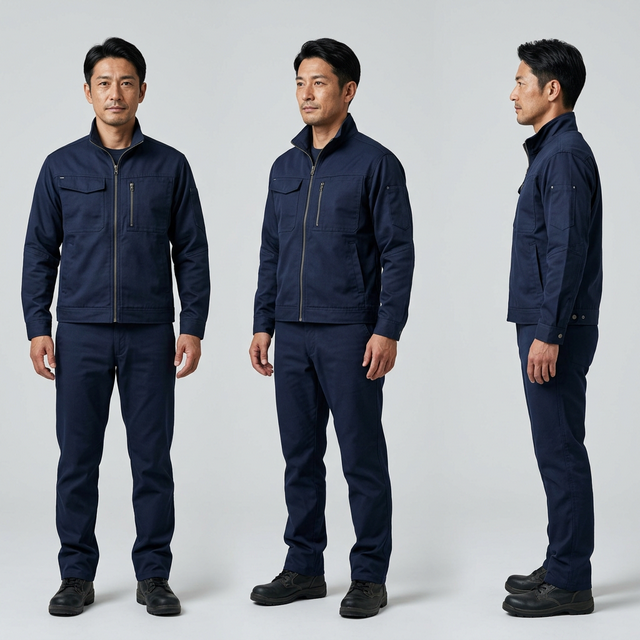

# Character Consistency Guide

This document defines the anchor identities (Personas) used in the Protocol-First Workflow. By strictly enforcing these Personas in all generated prompts and using the provided Character Reference Sheets for Image-to-Image (or FaceID/IP-Adapter) anchoring, we ensure that the exact same individuals appear across all experiment images.

All characters are dressed in a specific modern navy blue industrial workwear uniform (zip-up jacket with a stand collar, right vertical zip pocket, left flap pocket, and matching pants). No logos or branding.

---

## Character 1: Standard Female Engineer (25 y/o)

> **[PERSONA DEFINITION]**
> A 25-years-old Japanese woman engineer. She has short black bob hair with straight, meticulously cut bangs, dark brown almond-shaped eyes, soft and symmetrical facial features, pale skin tone, and a neutral, professional expression. She is wearing a modern navy blue industrial workwear uniform. The uniform consists of a navy blue zip-up work jacket with a stand collar, a vertical zippered pocket on the right chest, a flap pocket on the left chest, and matching navy blue work pants. Absolutely no logos, no text, no branding. Dark safety shoes.

---

## Character 2: Young Female Engineer (22 y/o)

> **[PERSONA DEFINITION]**
> A 22-years-old Japanese woman engineer, 160cm tall. She has medium-length brown hair. She is very beautiful and cute, but possesses a highly natural, grounded, everyday reality look—avoiding any glossy, artificial AI aesthetic. She looks like a real person you would meet. She is wearing a modern navy blue industrial workwear uniform. The uniform consists of a navy blue zip-up work jacket with a stand collar, a vertical zippered pocket on the right chest, a flap pocket on the left chest, and matching navy blue work pants. Absolutely no logos, no text, no branding. Dark safety shoes.

---

## Character 3: Professional Male Engineer (35 y/o)

> **[PERSONA DEFINITION]**
> A 35-years-old Japanese man, an experimental professional. He has short, neatly styled black hair. He exudes a solid, sincere, dependable, and highly experienced aura, with a grounded and realistic face. He is wearing a modern navy blue industrial workwear uniform. The uniform consists of a navy blue zip-up work jacket with a stand collar, a vertical zippered pocket on the right chest, a flap pocket on the left chest, and matching navy blue work pants. Absolutely no logos, no text, no branding. Dark safety shoes.

---

## Workflow Integration
When generating a new scientific experiment image:
1. **Text Level**: Select one of the `[PERSONA DEFINITION]` blocks and place it at the very beginning of your prompt, followed by the `[EXTREMELY STRICT RULES]` block defining the experiment's physical constraints.
2. **Visual Level**: Upload the corresponding `charN_*.png` reference sheet into your generation tool's Character Reference feature (e.g., Midjourney `--cref`, nanobanana pro's character consistency, or ComfyUI IP-Adapter/FaceID).
3. **Pose Level**: Upload 1-3 actual experiment reference photos into the image-to-image/ControlNet fields.
