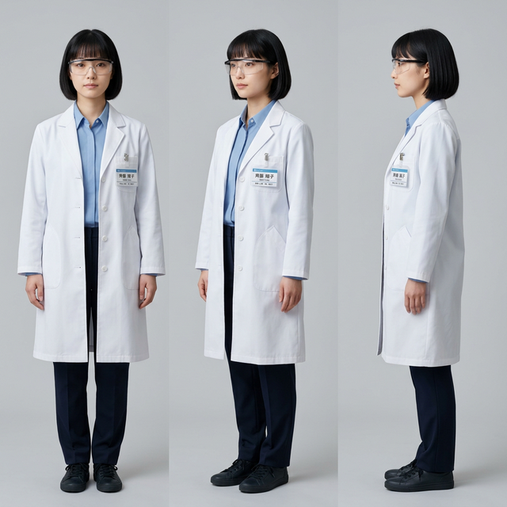

# Character Consistency Guide

This document defines the anchor identity (Persona) for the scientist used in the Protocol-First Workflow. By strictly enforcing this Persona in all generated prompts and using the provided Character Reference Sheet for Image-to-Image (or FaceID/IP-Adapter) anchoring, we ensure that the exact same person appears across all experiment images.

## 1. Persona Definition Block
Always prepend or include this exact block of text in your generation prompts to anchor the physical traits:

> **[PERSONA DEFINITION]**
> A 25-years-old Japanese woman scientist. She has short black bob hair with straight, meticulously cut bangs, dark brown almond-shaped eyes, soft and symmetrical facial features, pale skin tone, and a neutral, professional expression. She is wearing clear safety goggles with black rims over her eyes, and a crisp white unbuttoned laboratory coat over a plain light blue collared shirt.

## 2. Definitive Character Reference Sheet
The following image serves as the absolute visual anchor. It contains the front, 3/4 turn, and side profile views necessary for advanced AI models (such as Midjourney's `--cref` or Stable Diffusion's IP-Adapter FaceID) to lock onto the character's facial geometry.

## 3. Workflow Integration
When generating a new scientific experiment image:
1. **Text Level**: Use the `[PERSONA DEFINITION]` block at the very beginning of your prompt, followed by the `[EXTREMELY STRICT RULES]` block defining the experiment's physical constraints.
2. **Visual Level**: If your generation tool supports Character References (e.g., nanobanana pro's character consistency features, Midjourney's `--cref`), upload `character_reference_sheet.png` as the reference image.
3. **Pose Level**: Upload your 1-3 actual experiment reference photos (from SOP research) into the Image-to-Image / Canny / Depth / Pose control fields.
